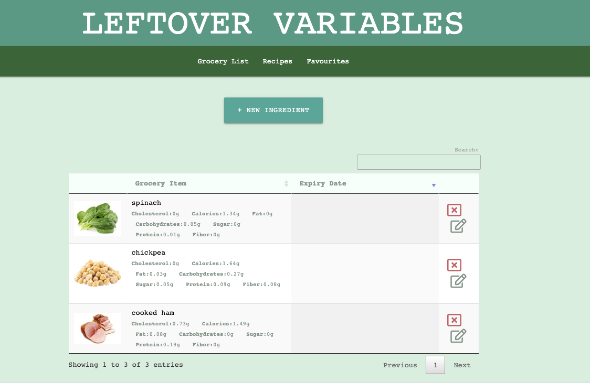

# Unit 07: Project - First Team Website Project 

## Website Name:  Leftover Variables

## Overview:

* A web application that will allow a user to:

- Enter, store and maintain grocery items from their fridge and pantry  

- Track expiry dates on grocery items 

- Provide the option to use these grocery items to search and find delicious recipes that utilize these ingredients
    
- Review nutritional information on the grocery items

- Save a recipe to a favorites page to be referenced later 

## Objectives:

- Reduce food waste by using items you already have on hand

- Reduce food waste by tracking expiration dates on items 

- Eat delicious meals using the recipes found

- Eat well by providing nutritional details on grocery items

## Project Preparation

- Developed an idea for a website

- Created a team Github repository to allow developers to commit and share the latest code

- Created a team Github project to enter and track user stories and tasks and assignments

- Created a wireframe illustrating objects and navigation flow

- Investigated API's to use to provide data for our website

- Investigated Bootstrap alternative - chose Materialize

- Created boilerplate code and pushed to repository

- Split up and assigned the work

## Agile Process

We used an agile process to design, develop and test.  Followed the following:

1. Planning 

2. Creating / Developing

3. Reviewing

4. Make Adjustments

5. Repeat Steps

## API's

Spoonacular - Used For:

- Pictures of grocery items

- Nutrient Info

- Auto complete form

Edamam - Used For:

- Find recipes using grocery items available

- Saved recipes

- Pictures of recipes

## Other Reference Libraries

- Materialize

- Fontawesome

- Jquery DataTables

- Cloudflare

- Moment

The following image demonstrates the web application's appearance:

To view the working app use the link below:

https://elmirlekovic.github.io/left-over-variables/